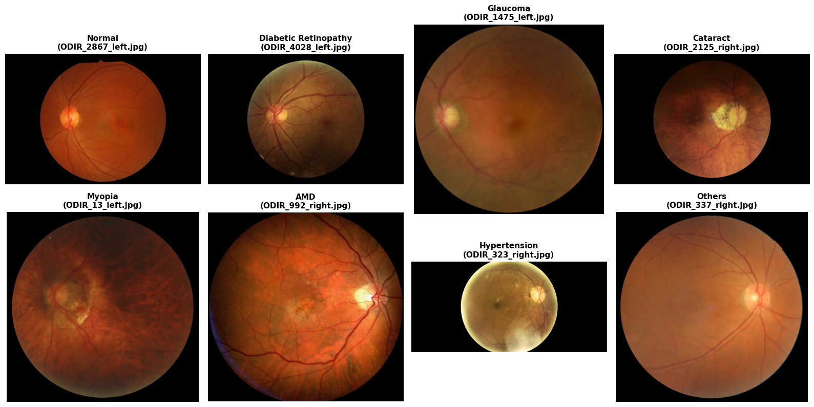

# Retinal Disease Classification from Fundus Images

This project involves building and evaluating deep learning classifiers to identify eight retinal disease categories from fundus images. 

The categories are:
*   Normal
*   Diabetic Retinopathy
*   Glaucoma
*   Cataract
*   Myopia
*   AMD (Age-related Macular Degeneration)
*   Hypertension
*   Others

---

## 1. Dataset & Class Distribution

The training dataset has high class imbalance, with the majority of samples belonging to the **Normal** and **Diabetic Retinopathy** classes.

### Training Set Sample Counts
*   **Normal:** 3,808
*   **Diabetic Retinopathy:** 3,318
*   **Others:** 893
*   **Glaucoma:** 753
*   **Cataract:** 275
*   **Myopia:** 238
*   **AMD:** 221
*   **Hypertension:** 71

---

## 2. Sample Fundus Images

Below are representative fundus images from each of the eight clinical classes used during training:

---

## 3. Custom CNN Model (From Scratch)

A custom Convolutional Neural Network (CNN) was trained from scratch for 50 epochs. Class weights were applied to adjust for the training set imbalance.

### Training Metrics

The plots below display the training and validation progress across 50 epochs for loss, accuracy, precision, recall, and macro F1-score:

### Test Set Performance (Custom CNN)

After 50 epochs, the model achieved an overall accuracy of **0.53** on the test set.

| Retinal Condition | Precision | Recall | F1-Score | Support |
| :--- | :---: | :---: | :---: | :---: |
| Normal | 0.78 | 0.54 | 0.63 | 423 |
| Diabetic Retinopathy | 0.78 | 0.53 | 0.63 | 369 |
| Glaucoma | 0.45 | 0.69 | 0.55 | 84 |
| Cataract | 0.42 | 0.81 | 0.56 | 31 |
| Myopia | 0.32 | 0.77 | 0.45 | 26 |
| AMD | 0.07 | 0.36 | 0.12 | 25 |
| Hypertension | 0.25 | 0.12 | 0.17 | 8 |
| Others | 0.19 | 0.28 | 0.23 | 99 |
| **Accuracy** | | | **0.53** | **1,065** |
| **Macro Average** | **0.41** | **0.51** | **0.42** | **1,065** |
| **Weighted Average** | **0.66** | **0.53** | **0.57** | **1,065** |

---

## 4. Fine-Tuned ResNet Model

*(This section will be populated once the ResNet model training is complete)*

### Training Metrics

`[Insert ResNet Training Metrics Graph Here]`

### Test Set Performance (ResNet)

| Retinal Condition | Precision | Recall | F1-Score | Support |
| :--- | :---: | :---: | :---: | :---: |
| Normal | 0.00 | 0.00 | 0.00 | 423 |
| Diabetic Retinopathy | 0.00 | 0.00 | 0.00 | 369 |
| Glaucoma | 0.00 | 0.00 | 0.00 | 84 |
| Cataract | 0.00 | 0.00 | 0.00 | 31 |
| Myopia | 0.00 | 0.00 | 0.00 | 26 |
| AMD | 0.00 | 0.00 | 0.00 | 25 |
| Hypertension | 0.00 | 0.00 | 0.00 | 8 |
| Others | 0.00 | 0.00 | 0.00 | 99 |
| **Accuracy** | | | **0.00** | **1,065** |
| **Macro Average** | **0.00** | **0.00** | **0.00** | **1,065** |
| **Weighted Average** | **0.00** | **0.00** | **0.00** | **1,065** |
