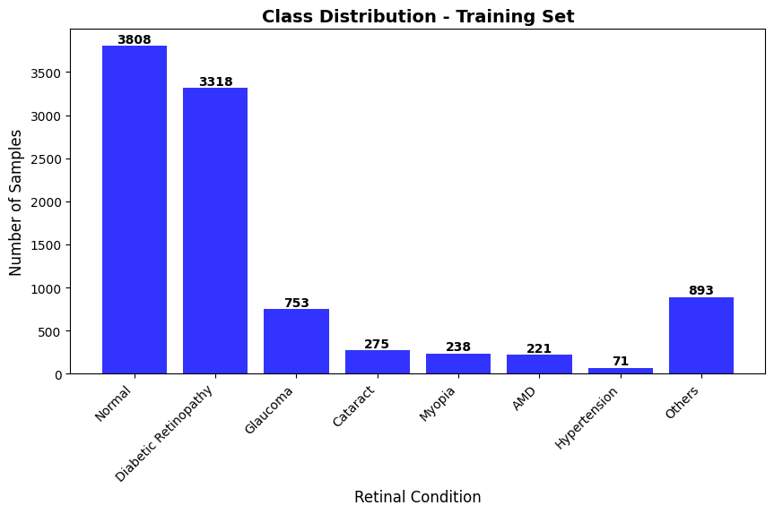
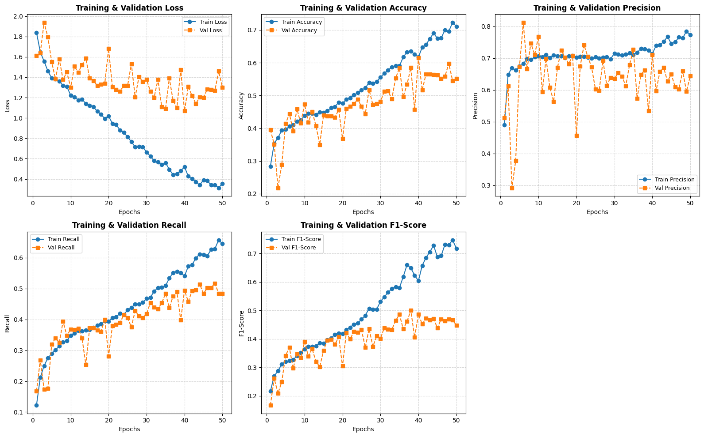

# Retinal Disease Classification from Fundus Images

This project involves building and evaluating deep learning classifiers to identify eight retinal disease categories from fundus images. 

The categories are:
*   Normal
*   Diabetic Retinopathy
*   Glaucoma
*   Cataract
*   Myopia
*   AMD (Age-related Macular Degeneration)
*   Hypertension
*   Others

---

## 1. Dataset & Class Distribution

The training dataset has high class imbalance, with the majority of samples belonging to the **Normal** and **Diabetic Retinopathy** classes.

### Training Set Sample Counts
*   **Normal:** 3,808
*   **Diabetic Retinopathy:** 3,318
*   **Others:** 893
*   **Glaucoma:** 753
*   **Cataract:** 275
*   **Myopia:** 238
*   **AMD:** 221
*   **Hypertension:** 71

---
## 2. Sample Fundus Images

Below are representative fundus images from each of the eight clinical classes used during training:

---

## 3. Custom CNN Model (From Scratch)

A custom Convolutional Neural Network (CNN) was trained from scratch for 50 epochs. Class weights were applied to adjust for the training set imbalance.

### Training Metrics

The plots below display the training and validation progress across 50 epochs for loss, accuracy, precision, recall, and macro F1-score:

### Test Set Performance (Custom CNN)

After 50 epochs, the model achieved an overall accuracy of **0.53** on the test set.

| Retinal Condition | Precision | Recall | F1-Score | Support |
| :--- | :---: | :---: | :---: | :---: |
| Normal | 0.78 | 0.54 | 0.63 | 423 |
| Diabetic Retinopathy | 0.78 | 0.53 | 0.63 | 369 |
| Glaucoma | 0.45 | 0.69 | 0.55 | 84 |
| Cataract | 0.42 | 0.81 | 0.56 | 31 |
| Myopia | 0.32 | 0.77 | 0.45 | 26 |
| AMD | 0.07 | 0.36 | 0.12 | 25 |
| Hypertension | 0.25 | 0.12 | 0.17 | 8 |
| Others | 0.19 | 0.28 | 0.23 | 99 |
| **Accuracy** | | | **0.53** | **1,065** |
| **Macro Average** | **0.41** | **0.51** | **0.42** | **1,065** |
| **Weighted Average** | **0.66** | **0.53** | **0.57** | **1,065** |

---

## 4. Fine-Tuned ResNet50 Model

A pre-trained ResNet50 model was adapted and fine-tuned on the fundus images.

### Preprocessing and Training Metrics

It is critical to use ResNet50's official preprocessing function: `tf.keras.applications.resnet50.preprocess_input(img)`. When using standard [0, 1] scaling (as used for the custom CNN), the model is unable to learn effectively, failing to outperform the from-scratch CNN. This incorrectly preprocessed training run is illustrated below:

With the correct preprocessing function applied, the training and validation progress across 50 epochs is plotted below:

### Test Set Performance (ResNet50)

With correct preprocessing applied, the fine-tuned ResNet50 model achieved an overall accuracy of **0.61** on the test set.

| Retinal Condition | Precision | Recall | F1-Score | Support |
| :--- | :---: | :---: | :---: | :---: |
| Normal | 0.80 | 0.63 | 0.71 | 423 |
| Diabetic Retinopathy | 0.88 | 0.55 | 0.68 | 369 |
| Glaucoma | 0.47 | 0.75 | 0.58 | 84 |
| Cataract | 0.57 | 0.87 | 0.69 | 31 |
| Myopia | 0.71 | 0.85 | 0.77 | 26 |
| AMD | 0.24 | 0.48 | 0.32 | 25 |
| Hypertension | 0.19 | 0.38 | 0.25 | 8 |
| Others | 0.24 | 0.54 | 0.33 | 99 |
| **Accuracy** | | | **0.61** | **1,065** |
| **Macro Average** | **0.51** | **0.57** | **0.54** | **1,065** |
| **Weighted Average** | **0.72** | **0.61** | **0.64** | **1,065** |

---

## 5. Model Comparison & Deployment Analysis

### Impact of Class Imbalance
*   Both models struggled with the rarest class, **Hypertension** (8 support samples). However, with correct preprocessing, the fine-tuned ResNet50 achieved an F1-score of 0.25 (Recall of 0.38), outperforming the custom CNN (F1-score of 0.17). This indicates that the pre-trained feature weights are more robust under severe data scarcity than features learned from scratch.
*   The fine-tuned **ResNet50** model managed class imbalance better on moderately rare categories like **Cataract** (F1-score 0.69 vs 0.56) and **Myopia** (F1-score 0.77 vs 0.45), outperforming the custom CNN across those conditions.

### Real-Time Deployment Considerations
*   **ResNet50:** Achieved higher accuracy (0.61 vs 0.53) and a higher macro F1-score (0.54 vs 0.42). However, it has a larger computational and parameter footprint, resulting in slower inference times. It is best suited for **server-side deployments** where cloud GPUs handle the compute overhead.
*   **Custom CNN:** Demonstrates lower performance but is computationally lightweight. It is better suited for **edge deployment** directly inside portable, low-compute clinical device hardware where processing latency and network access are restricted.

---

## 6. Conclusion

*   **Model Comparison:** Under the same training length (50 epochs), the pre-trained ResNet50 model outperformed the custom CNN from-scratch model, raising overall test accuracy from 0.53 to 0.61 and the macro F1-score from 0.42 to 0.54.
*   **Convergence Rate:** The pre-trained ResNet50 converged faster than the custom model due to its starting weights inherited from ImageNet.
*   **Preprocessing Significance:** Preprocessing is a critical factor in transfer learning. Using the standard [0, 1] scaling pipeline of the custom CNN on ResNet50 severely limits feature extraction, causing it to underperform compared to the custom CNN. To achieve optimal performance, the model must be fed using ResNet50's native channel-mean subtraction and color-space conversion (`tf.keras.applications.resnet50.preprocess_input`).
