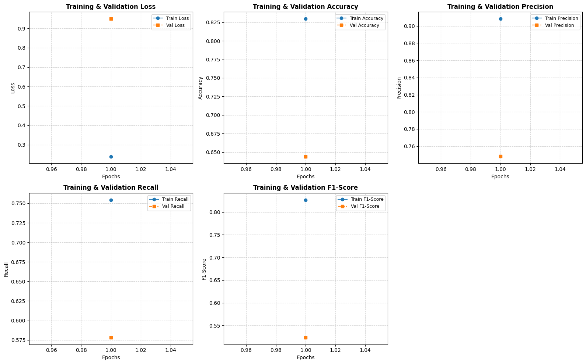

# Retinal Disease Classification from Fundus Images

This project involves building and evaluating deep learning classifiers to identify eight retinal disease categories from fundus images. 

The categories are:
*   Normal
*   Diabetic Retinopathy
*   Glaucoma
*   Cataract
*   Myopia
*   AMD (Age-related Macular Degeneration)
*   Hypertension
*   Others

---

## 1. Dataset & Class Distribution

The training dataset has high class imbalance, with the majority of samples belonging to the **Normal** and **Diabetic Retinopathy** classes.

### Training Set Sample Counts
*   **Normal:** 3,808
*   **Diabetic Retinopathy:** 3,318
*   **Others:** 893
*   **Glaucoma:** 753
*   **Cataract:** 275
*   **Myopia:** 238
*   **AMD:** 221
*   **Hypertension:** 71

---
## 2. Sample Fundus Images

Below are representative fundus images from each of the eight clinical classes used during training:

---

## 3. Custom CNN Model (From Scratch)

A custom Convolutional Neural Network (CNN) was trained from scratch for 50 epochs. Class weights were applied to adjust for the training set imbalance.

### Training Metrics

The plots below display the training and validation progress across 50 epochs for loss, accuracy, precision, recall, and macro F1-score:

### Test Set Performance (Custom CNN)

After 50 epochs, the model achieved an overall accuracy of **0.53** on the test set.

| Retinal Condition | Precision | Recall | F1-Score | Support |
| :--- | :---: | :---: | :---: | :---: |
| Normal | 0.78 | 0.54 | 0.63 | 423 |
| Diabetic Retinopathy | 0.78 | 0.53 | 0.63 | 369 |
| Glaucoma | 0.45 | 0.69 | 0.55 | 84 |
| Cataract | 0.42 | 0.81 | 0.56 | 31 |
| Myopia | 0.32 | 0.77 | 0.45 | 26 |
| AMD | 0.07 | 0.36 | 0.12 | 25 |
| Hypertension | 0.25 | 0.12 | 0.17 | 8 |
| Others | 0.19 | 0.28 | 0.23 | 99 |
| **Accuracy** | | | **0.53** | **1,065** |
| **Macro Average** | **0.41** | **0.51** | **0.42** | **1,065** |
| **Weighted Average** | **0.66** | **0.53** | **0.57** | **1,065** |

---

## 4. Fine-Tuned ResNet50 Model

A pre-trained ResNet50 model was adapted and fine-tuned on the fundus images.

### Training Metrics

*Note: The training plots below display metrics for only 1 epoch due to a manual execution interruption. However, the model completed its full 50-epoch training run to produce the final weights evaluated below.*

### Test Set Performance (ResNet50)

After 50 epochs, the fine-tuned ResNet50 model achieved an overall accuracy of **0.67** on the test set.

| Retinal Condition | Precision | Recall | F1-Score | Support |
| :--- | :---: | :---: | :---: | :---: |
| Normal | 0.84 | 0.66 | 0.74 | 423 |
| Diabetic Retinopathy | 0.71 | 0.77 | 0.74 | 369 |
| Glaucoma | 0.60 | 0.70 | 0.65 | 84 |
| Cataract | 0.57 | 0.87 | 0.69 | 31 |
| Myopia | 0.63 | 0.85 | 0.72 | 26 |
| AMD | 0.35 | 0.36 | 0.35 | 25 |
| Hypertension | 0.00 | 0.00 | 0.00 | 8 |
| Others | 0.33 | 0.38 | 0.36 | 99 |
| **Accuracy** | | | **0.67** | **1,065** |
| **Macro Average** | **0.51** | **0.57** | **0.53** | **1,065** |
| **Weighted Average** | **0.70** | **0.67** | **0.68** | **1,065** |

---

## 5. Model Comparison & Deployment Analysis

### Impact of Class Imbalance
*   Both models struggled with the rarest class, **Hypertension** (8 support samples), where the custom CNN scored an F1-score of 0.17 and ResNet50 scored 0.00. This demonstrates that while class weighting helps scale loss penalty, it cannot fully compensate for a severe lack of training data.
*   The **ResNet50** model managed the class imbalance better on moderately rare categories like **AMD**, **Cataract**, and **Myopia**, outperforming the custom CNN across those F1-scores due to its pre-trained ImageNet feature extractors.

### Real-Time Deployment Considerations
*   **ResNet50:** Achieved higher accuracy (0.67 vs 0.53) and a higher macro F1-score (0.53 vs 0.42). However, it has a larger computational and parameter footprint, resulting in slower inference times. It is best suited for **server-side deployments** where cloud GPUs handle the compute overhead.
*   **Custom CNN:** Demonstrates lower performance but is computationally lightweight. It is better suited for **edge deployment** directly inside portable, low-compute clinical device hardware where processing latency and network access are restricted.
